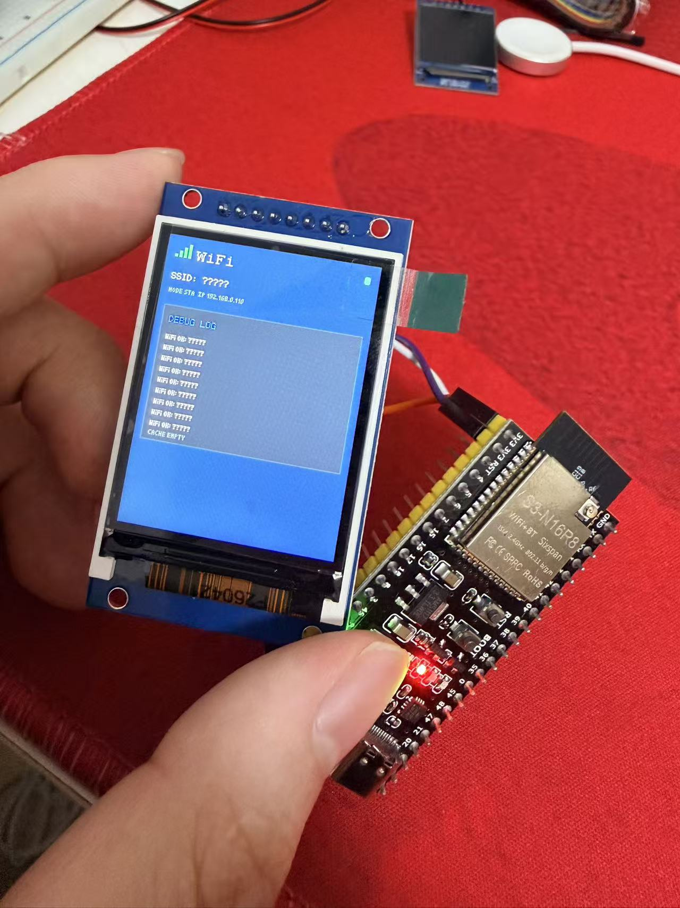

# 用 ESP32-S3 和 TinyGo，先搭个 AI 语音助手的小底座

最近想折腾一个硬件版的 AI 语音助手。

不是网页聊天框那种，而是一个能放在桌面上的小东西：按一下或者叫它一下，它能录音，把问题发给 AI，然后自己用扬声器说回来。

代码在这里：[baiyuze/tinygo-ai](https://github.com/baiyuze/tinygo-ai)



现在市面上已经有不少类似“小智 AI”的方案了，有成品，也有开源项目。我不是想说自己要从零做一个多厉害的东西，主要还是想自己走一遍流程。

先把 ESP32-S3、屏幕、配网、状态显示这些东西跑起来。哪怕最后只是个小玩具，也算是一个入门场景。后面真有什么想法，比如加录音、加喇叭、接不同的模型，也能直接在这个基础上继续试。

## 现在做到哪了

目前还没到“能听会说”的阶段。

这一步主要做的是设备启动后的基础部分：

- 开机初始化串口、WiFi、RGB 灯和 ST7789 屏幕。
- 屏幕会先刷红、绿、蓝，方便确认屏幕接线和驱动没问题。
- 设备会先读 Flash 里保存过的 WiFi 配置。
- 如果连不上，或者没有配置，就开一个 `tinygo-s3-setup` 热点。
- 手机连上这个热点后，访问 `http://192.168.4.1/`。
- 页面里可以填 WiFi 名称、密码和 AI API Key。
- 保存后会写进 Flash，下次开机继续用。
- WiFi 连上后，RGB 灯变绿；配网模式是蓝色；出错是红色。
- 还有一个 `/debug` 页面，可以看当前模式、IP 和最近日志。

这些东西看起来比较“底层”，但硬件项目里还挺必要的。不然每次换 WiFi 都要重新烧录，或者设备卡住了只能看串口，会很难继续往下做。

## 想做成什么样

后面大概想做成这样的流程：

```text
按键/唤醒
  -> 麦克风录音
  -> ESP32-S3 通过 WiFi 发出去
  -> AI 做语音识别和回答
  -> TTS 合成语音
  -> 扬声器播放
  -> 屏幕和 RGB 灯显示状态
```

也就是一个很朴素的 AI 语音助手。

先不追求复杂交互，也不追求外观。能跑通一轮“人说话 -> AI 回答 -> 设备说话”，就已经挺有意思了。

## 硬件

现在用到的东西很少：

| 硬件 | 说明 |
| --- | --- |
| ESP32-S3 开发板 | 主控，跑 TinyGo 固件 |
| ST7789V2 屏幕 | 2.0 寸，240x320，SPI |
| WS2812 RGB 灯 | 用来显示状态，当前走 GPIO48 |
| USB 数据线 | 烧录和看串口 |
| 杜邦线/排针 | 接屏幕 |

屏幕接线：

| 屏幕引脚 | ESP32-S3 引脚 |
| --- | --- |
| VCC | 3V3 |
| GND | GND |
| BL | 3V3 |
| CS | GPIO10 |
| DC | GPIO11 |
| RST | GPIO12 |
| SCL/SCK | GPIO13 |
| SDA/MOSI | GPIO14 |

其他引脚：

| 功能 | 引脚 |
| --- | --- |
| BOOT 强制配网 | GPIO0 |
| RGB 状态灯 | GPIO48 |

后面做语音的时候，还要加 I2S 麦克风、功放或者 DAC、扬声器，可能还会加一个按键用来控制录音。

## 代码结构

项目结构大概是这样：

```text
main.go
  -> app.Run()
      -> boot        BOOT 键长按检测
      -> rgb         WS2812 状态灯
      -> display     ST7789 屏幕、自检、调试面板
      -> wifi        WiFi STA/AP、DHCP、网络栈轮询
      -> portal      配网页面和 debug 页面
      -> store       Flash 读写，保存 WiFi 和 API Key
      -> diag        状态和日志
```

启动的时候，`app.Run()` 先把串口和 WiFi Radio 起起来，然后初始化 RGB 和屏幕。

屏幕初始化后会先做一个颜色自检。这个地方对硬件调试很有用，因为屏幕没亮的时候，很难判断是 SPI、引脚、背光还是驱动配置的问题。

然后检查 BOOT 键。如果按住 BOOT 大概 3 秒，就不管之前有没有保存 WiFi，直接进配网模式。这个功能主要是防止 WiFi 写错后设备一直连不上。

正常情况下，它会先读 Flash 里的配置，能连上就进入 STA 模式。连不上就开 AP 模式，让手机来配。

## 配网

配网流程现在比较简单：

```text
开机
  -> 读 Flash
  -> 有配置就尝试连 WiFi
  -> 失败就开热点 tinygo-s3-setup
  -> 手机打开 192.168.4.1
  -> 填 WiFi 和 API Key
  -> 保存到 Flash
  -> 再尝试连 WiFi
```

AP 模式下，ESP32-S3 自己开热点，也自己跑 DHCP。手机连上之后访问：

```text
http://192.168.4.1/
```

页面只有几个输入框：

- WiFi 名称
- WiFi 密码
- AI API Key

保存以后，设备会把内容写进 Flash。下次启动时会优先用这份配置。

还有一个调试页面：

```text
http://设备IP/debug
```

或者在 AP 模式下：

```text
http://192.168.4.1/debug
```

这个页面能看到当前模式、SSID、IP、缓存状态、最近 HTTP 请求和日志。设备不插电脑的时候，这个页面挺方便。

## Flash 里怎么存

现在没有上什么复杂存储，就用了 Flash 最后一个 4KB 扇区。

里面放：

- SSID
- Password
- API Key

为了避免乱读，还加了几个字段：

- magic
- version
- 长度
- checksum

这块目前够原型用了。

不过 API Key 现在是明文写 Flash 的，这点要注意。自己玩没问题，如果后面真要长期用，肯定要重新考虑安全性。

## 屏幕和灯

硬件调试里，屏幕和灯真的能省不少时间。

当前屏幕会显示：

- WiFi 状态
- SSID
- IP
- 最近日志
- 缓存状态
- 错误信息

RGB 灯目前只有三种状态：

| 颜色 | 状态 |
| --- | --- |
| 蓝色 | 配网模式 |
| 绿色 | WiFi 已连接 |
| 红色 | 出错 |

后面如果做语音交互，灯效可以继续加，比如录音、思考、播放回答这些状态。

## 烧录

项目用 Go + TinyGo。

依赖主要是这些：

- `tinygo.org/x/espradio`
- `tinygo.org/x/drivers`
- `tinygo.org/x/tinyfont`
- `github.com/soypat/lneto`

烧录命令：

```bash
go mod download
tinygo flash -target=ESP32-S3-generetor -port=/dev/tty.usbmodemXXXX .
```

看串口：

```bash
screen /dev/tty.usbmodemXXXX 115200
```

这里的 `-target` 要按自己的硬件来。我这块板子用的是 `ESP32-S3-generetor`。

## 大概成本

按散件算，不带外壳的话成本不高：

| 项目 | 估算 |
| --- | --- |
| ESP32-S3 开发板 | 25-60 元 |
| 2.0 寸 ST7789V2 屏幕 | 18-45 元 |
| 杜邦线/排针/面包板 | 5-20 元 |
| 外接 WS2812 灯 | 1-5 元 |
| 外壳/亚克力/3D 打印 | 10-50 元 |

现在这个阶段，大概 50-130 元可以玩起来。后面加麦克风、功放、扬声器，还会再多一点。

AI 调用费用另算。目前只是把 API Key 填进去和存起来，还没真正开始请求模型。

## 后面准备做什么

接下来会继续往“能听会说”走：

- 接 I2S 麦克风，先把录音搞定。
- 决定录音触发方式，可能先用按键。
- 把音频发给 AI 服务做识别和回答。
- 接 TTS，把回答转成语音。
- 接功放和扬声器，让设备能播放出来。
- 屏幕上显示识别文字、回答摘要和当前状态。
- 把断线重连、错误提示这些补一补。

## 先这样

代码仓库：[baiyuze/tinygo-ai](https://github.com/baiyuze/tinygo-ai)

目前它还不是一个真正的 AI 语音助手，只是先把配网、显示、缓存和调试这些基础部分跑起来了。

但这一步做完之后，后面就比较好继续了。至少现在有一个能联网、能保存配置、能显示状态的小硬件了。接下来再把麦克风和扬声器接上，慢慢把它做成一个能说话的小玩具。

## 标题备选

我比较倾向这个：

**用 ESP32-S3 和 TinyGo，先搭个 AI 语音助手的小底座**

另外几个也可以：

- **我也来做一个 ESP32-S3 版 AI 语音助手**
- **从配网开始，折腾一个 ESP32-S3 AI 语音助手**
- **ESP32-S3 + TinyGo：先给 AI 语音助手搭个底座**
- **做个能听会说的小玩具：ESP32-S3 AI 语音助手记录 1**
